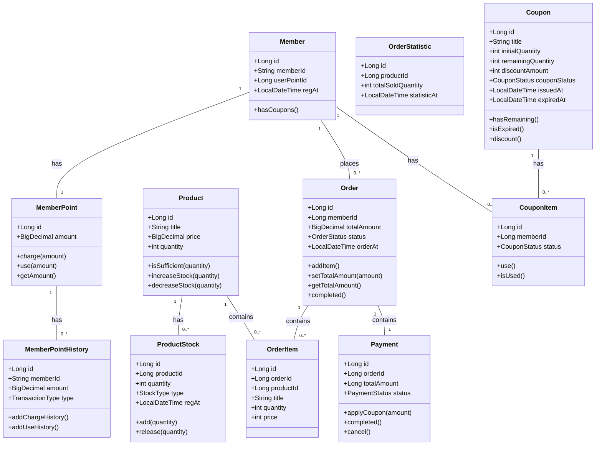

# 클래스 다이어그램

```mermaid
classDiagram

class Member {
    +Long id
    +String memberId
    +Long userPointId
    +LocalDateTime regAt
    +hasCoupons()
    
}
class MemberPoint {
    +Long id
    +BigDecimal amount
    +charge(amount)
    +use(amount)
    +getAmount()
}
class MemberPointHistory {
    +Long id
    +String memberId
    +BigDecimal amount
    +TransactionType type
    +addChargeHistory()
    +addUseHistory()
}
class Product {
    +Long id
    +String title
    +BigDecimal price
    +int quantity
    +isSufficient(quantity)
    +increaseStock(quantity)
    +decreaseStock(quantity)
}
class ProductStock {
    +Long id
    +Long productId
    +int quantity
    +StockType type
    +LocalDateTime regAt
    +add(quantity)
    +release(quantity)
}

class Order {
    +Long id
    +Long memberId
    +BigDecimal totalAmount
    +OrderStatus status
    +LocalDateTime orderAt
    +addItem()
    +setTotalAmount(amount)
    +getTotalAmount()
    +completed()
    
}

class OrderItem {
    +Long id
    +Long orderId
    +Long productId
    +String title
    +int quantity
    +int price
}

class OrderStatistic {
    +Long id
    +Long productId
    +int totalSoldQuantity
    +LocalDateTime statisticAt
}

class Payment {
    +Long id
    +Long orderId
    +Long totalAmount
    +PaymentStatus status
    +applyCoupon(amount)
    +completed()
    +cancel()
}

class Coupon {
    +Long id
    +String title
    +int initialQuantity
    +int remainingQuantity
    +int discountAmount
    +CouponStatus couponStatus
    +LocalDateTime issuedAt
    +LocalDateTime expiredAt
    +hasRemaining()
    +isExpired()
    +discount()
}
class CouponItem {
    +Long id
    +Long memberId
    +CouponStatus status
    +use()
    +isUsed()
}

Member "1" -- "1" MemberPoint : has
MemberPoint "1" -- "0..*" MemberPointHistory : has
Member "1" -- "0..*" Order : places
Order "1" -- "0..*" OrderItem : contains
Product "1" -- "0..*" OrderItem : contains
Order "1" -- "1" Payment : contains
Product "1" -- "0..*" ProductStock : has
Coupon "1" -- "0..*" CouponItem : has
Member "1" -- "0.." CouponItem : has

```