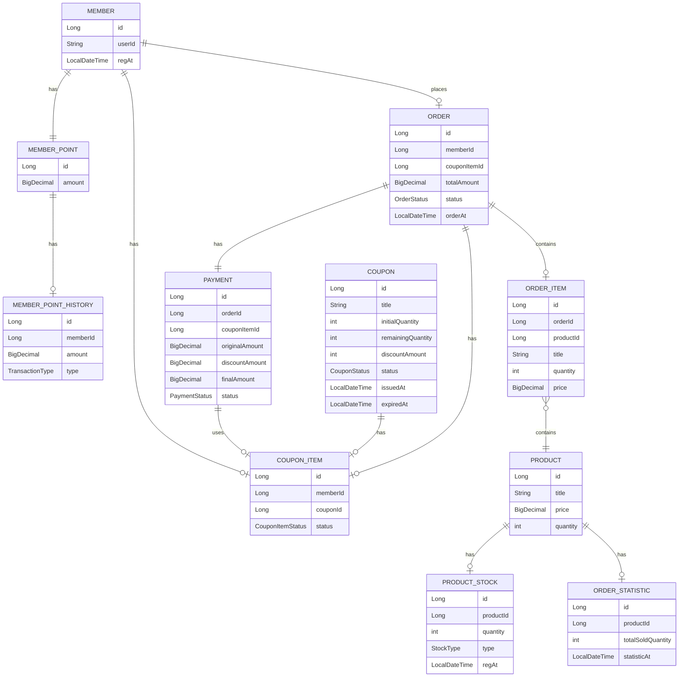

# ERD

```mermaid
erDiagram
    MEMBER {
        Long id
        String userId
        LocalDateTime regAt
    }
    MEMBER_POINT {
        Long id
        BigDecimal amount
    }
    MEMBER_POINT_HISTORY {
        Long id
        Long memberId
        BigDecimal amount
        TransactionType type
    }
    PRODUCT {
        Long id
        String title
        BigDecimal price
        int quantity
    }
    PRODUCT_STOCK {
        Long id
        Long productId
        int quantity
        StockType type
        LocalDateTime regAt
    }
    ORDER {
        Long id
        Long memberId
        Long couponItemId
        BigDecimal totalAmount
        OrderStatus status
        LocalDateTime orderAt
    }
    ORDER_ITEM {
        Long id
        Long orderId
        Long productId
        String title
        int quantity
        BigDecimal price
    }
    ORDER_STATISTIC {
        Long id
        Long productId
        int totalSoldQuantity
        LocalDateTime statisticAt
    }
    PAYMENT {
        Long id
        Long orderId
        Long couponItemId
        BigDecimal originalAmount
        BigDecimal discountAmount
        BigDecimal finalAmount
        PaymentStatus status
    }
    COUPON {
        Long id
        String title
        int initialQuantity
        int remainingQuantity
        int discountAmount
        CouponStatus status
        LocalDateTime issuedAt
        LocalDateTime expiredAt
    }
    COUPON_ITEM {
        Long id
        Long memberId
        Long couponId
        CouponItemStatus status
    }

    MEMBER ||--|| MEMBER_POINT : has
    MEMBER ||--o| COUPON_ITEM : has
    MEMBER ||--o| ORDER : places
    ORDER ||--|| PAYMENT : has
    ORDER ||--o| COUPON_ITEM : has
    ORDER ||--o| ORDER_ITEM : contains
    PRODUCT ||--o| PRODUCT_STOCK : has
    ORDER_ITEM }o--|| PRODUCT : contains
    PRODUCT ||--o| ORDER_STATISTIC : has
    COUPON ||--o| COUPON_ITEM : has
    PAYMENT ||--o| COUPON_ITEM : uses
    MEMBER_POINT ||--o| MEMBER_POINT_HISTORY : has

```