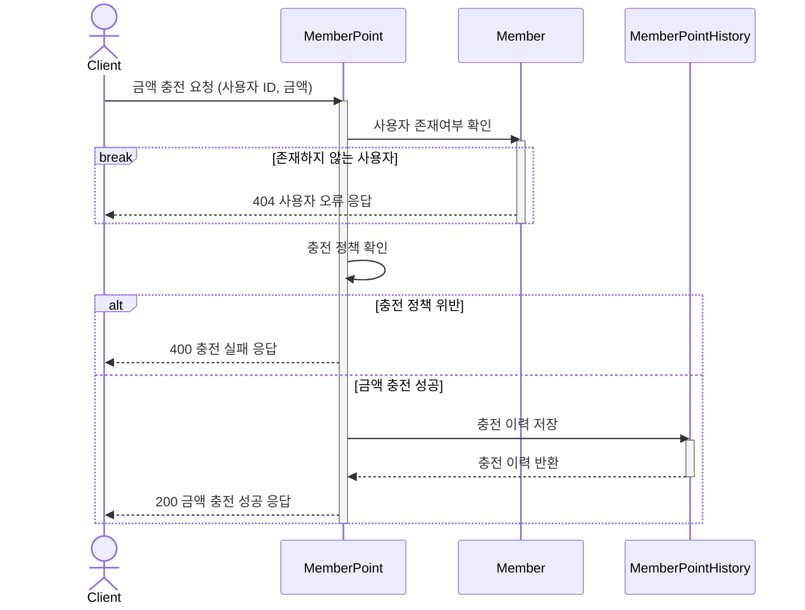

# 금액 충전 시퀀스

```mermaid
sequenceDiagram
    actor Client
    participant MemberPoint
    participant Member
    participant MemberPointHistory

    Client->>MemberPoint: 금액 충전 요청 (사용자 ID, 금액)

    activate MemberPoint
    MemberPoint->> Member: 사용자 존재여부 확인

    activate Member
    break 존재하지 않는 사용자
        Member-->>Client: 404 사용자 오류 응답
    end
    deactivate Member

    MemberPoint->>MemberPoint: 충전 정책 확인

    alt 충전 정책 위반
        MemberPoint-->>Client: 400 충전 실패 응답

    else 금액 충전 성공
        MemberPoint->>MemberPointHistory: 충전 이력 저장
        activate MemberPointHistory
        MemberPointHistory-->>MemberPoint: 충전 이력 반환
        deactivate MemberPointHistory

        MemberPoint-->>Client: 200 금액 충전 성공 응답
    end
    deactivate MemberPoint


```

---
## 충전 정책
1. 최대 금액 초과 시, 예외 발생합니다.