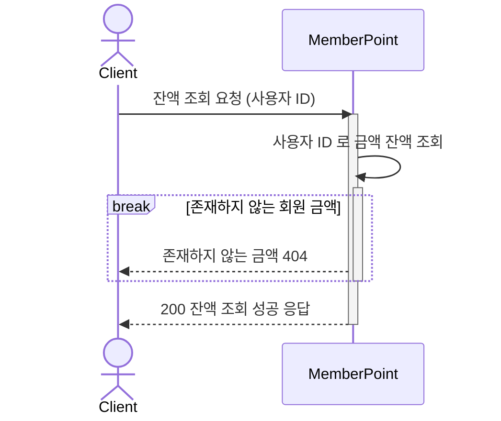

# 잔액 조회 시퀀스

```mermaid
sequenceDiagram
    actor Client
    participant MemberPoint

    Client->>MemberPoint: 잔액 조회 요청 (사용자 ID)
    activate MemberPoint
    MemberPoint->> MemberPoint: 사용자 ID 로 금액 잔액 조회
    activate MemberPoint
    break 존재하지 않는 회원 금액
        MemberPoint-->>Client: 존재하지 않는 금액 404
    end
    deactivate MemberPoint
    MemberPoint-->>Client: 200 잔액 조회 성공 응답


    deactivate MemberPoint


```
