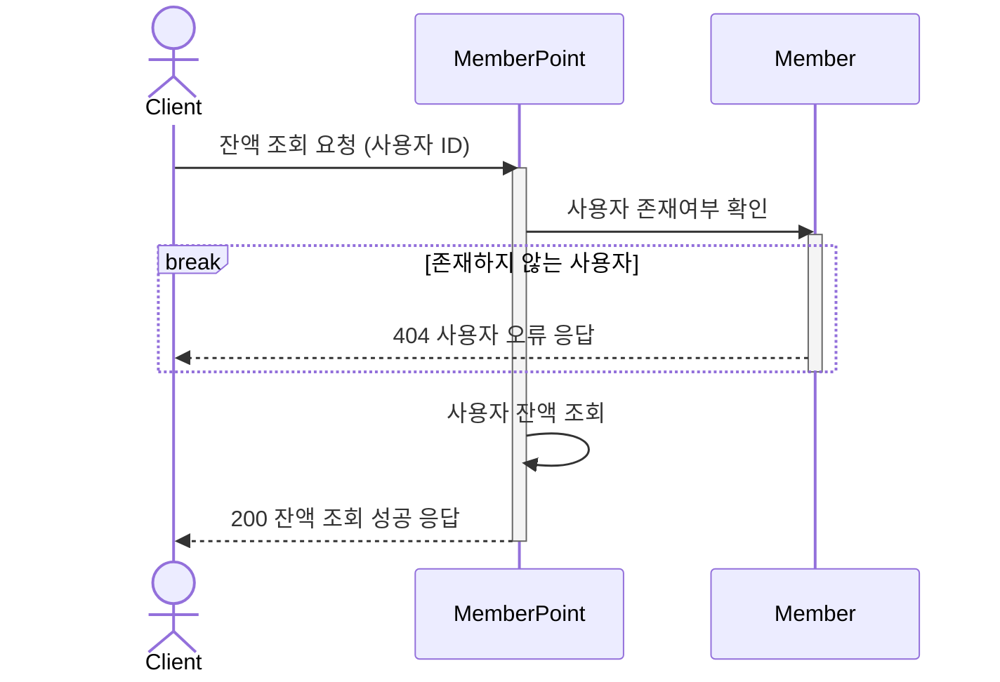

# 잔액 조회 시퀀스

```mermaid
sequenceDiagram
    actor Client
    participant MemberPoint
    participant Member

    Client->>MemberPoint: 잔액 조회 요청 (사용자 ID)
    activate MemberPoint
    MemberPoint->> Member: 사용자 존재여부 확인
    activate Member
    break 존재하지 않는 사용자
        Member-->>Client: 404 사용자 오류 응답
    end
    deactivate Member

    MemberPoint->>MemberPoint: 사용자 잔액 조회
    MemberPoint-->>Client: 200 잔액 조회 성공 응답


    deactivate MemberPoint


```
