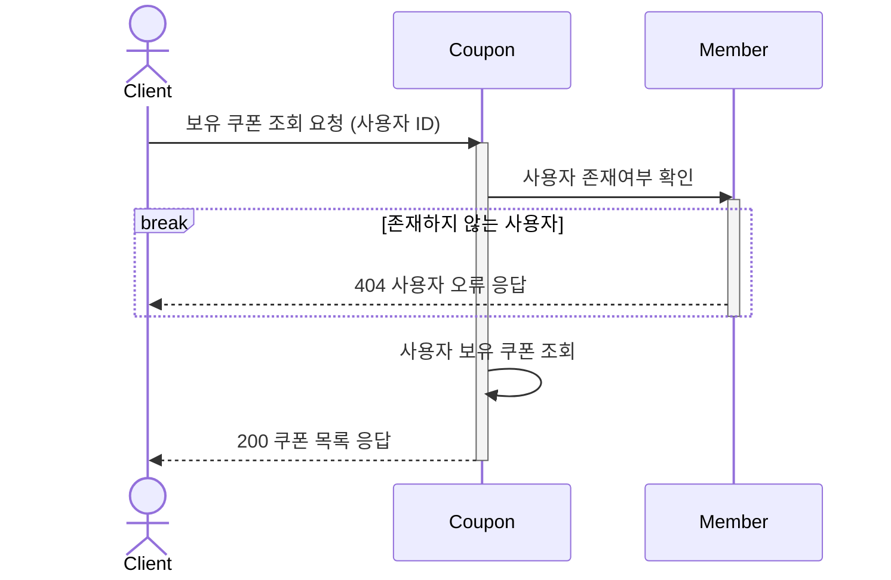

# 보유 쿠폰 목록 조회 시퀀스

```mermaid
sequenceDiagram
    actor Client
    participant Coupon

    Client->>Coupon: 보유 쿠폰 조회 요청 (사용자 ID)
    activate Coupon

    Coupon->>Member: 사용자 존재여부 확인
    activate Member
    break 존재하지 않는 사용자
        Member-->>Client: 404 사용자 오류 응답
    end
    deactivate Member

    Coupon->>Coupon: 사용자 보유 쿠폰 조회
    Coupon-->>Client: 200 쿠폰 목록 응답
    

    deactivate Coupon

```