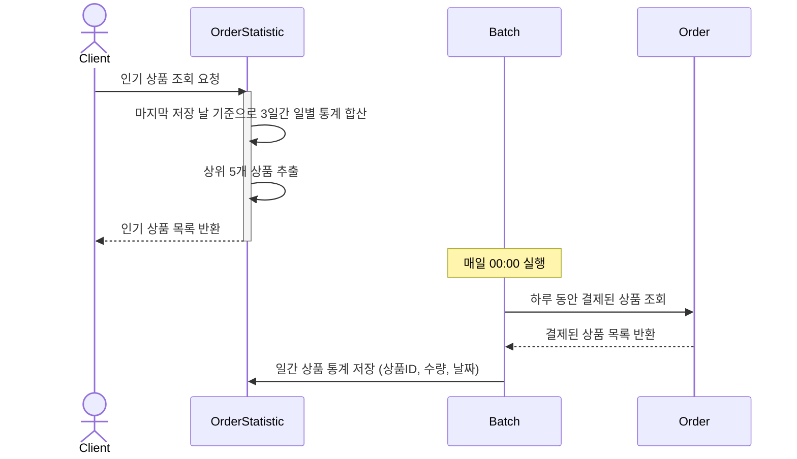

# 인기 상품 조회 시퀀스

```mermaid
sequenceDiagram
    actor Client
    participant OrderStatistic
    participant Batch
    participant Order

    Client->>OrderStatistic: 인기 상품 조회 요청
    activate OrderStatistic
    OrderStatistic->>OrderStatistic: 마지막 저장 날 기준으로 3일간 일별 통계 합산
    OrderStatistic->>OrderStatistic: 상위 5개 상품 추출
    OrderStatistic-->>Client: 인기 상품 목록 반환
    deactivate OrderStatistic

    Note over Batch: 매일 00:00 실행
    Batch->>Order: 하루 동안 결제된 상품 조회
    Order-->>Batch: 결제된 상품 목록 반환
    Batch->>OrderStatistic: 일간 상품 통계 저장 (상품ID, 수량, 날짜)
```
---
## 정책
1. 매일 00 시 기준으로 24시간 전까지의 주문 결제된 상품들을 조회 후, 저장합니다.
2. 저장된 상품의 마지막 날짜를 기준으로 3일 간의 통계를 합산합니다.
3. 상위 5개의 상품 중, 동일 판매량을 가진 상품들도 모두 포함시킵니다.