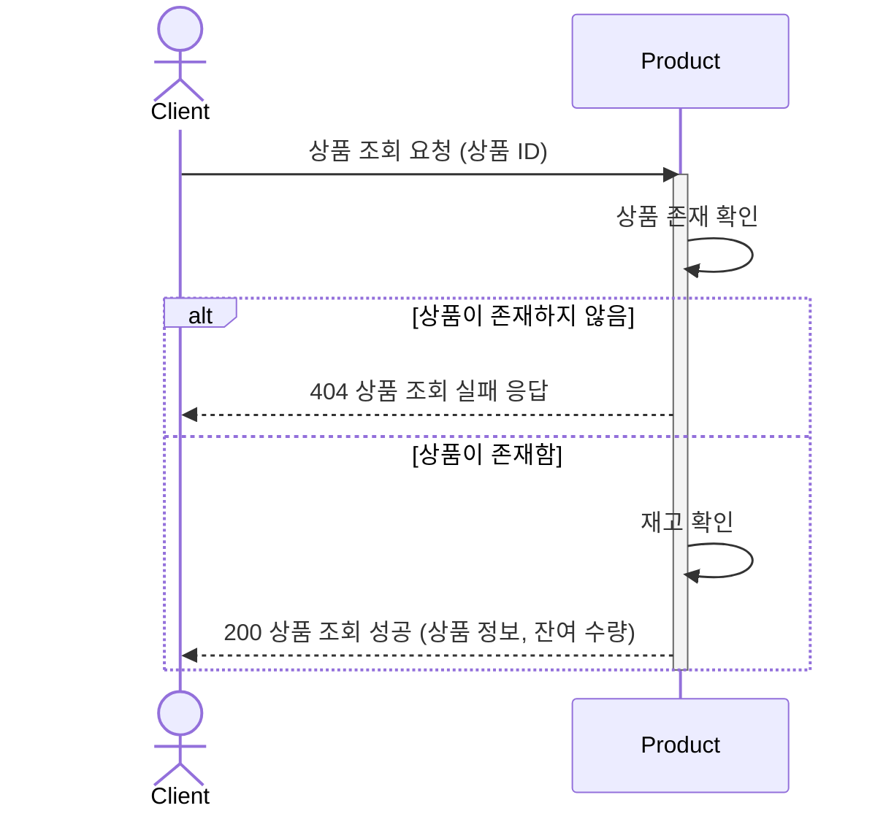

# 상품 조회 시퀀스

```mermaid
sequenceDiagram
    actor Client
    participant Product

    Client->>Product: 상품 조회 요청 (상품 ID)
    activate Product
    Product->>Product: 상품 존재 확인

    alt 상품이 존재하지 않음
        Product-->>Client: 404 상품 조회 실패 응답
    else 상품이 존재함
        Product->>Product: 재고 확인
        Product-->>Client: 200 상품 조회 성공 (상품 정보, 잔여 수량)
    end
    deactivate Product

```
