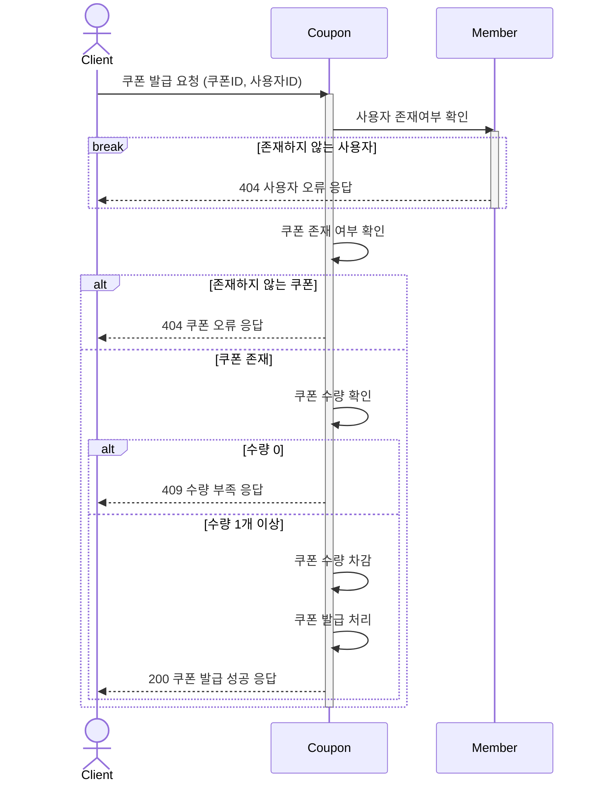

# 쿠폰 발급 시퀀스

```mermaid
sequenceDiagram
    actor Client
    participant Coupon
    participant Member


    Client->>Coupon: 쿠폰 발급 요청 (쿠폰ID, 사용자ID)
    activate Coupon
    Coupon->>Member: 사용자 존재여부 확인
    activate Member
    break 존재하지 않는 사용자
        Member-->>Client: 404 사용자 오류 응답
    end
    deactivate Member
    Coupon->>Coupon: 쿠폰 존재 여부 확인
    alt 존재하지 않는 쿠폰
        Coupon-->>Client: 404 쿠폰 오류 응답

    else 쿠폰 존재
        Coupon->>Coupon: 쿠폰 수량 확인

        alt 수량 0
            Coupon-->>Client: 409 수량 부족 응답

        else 수량 1개 이상
            Coupon->>Coupon: 쿠폰 수량 차감
            Coupon->>Coupon: 쿠폰 발급 처리
            Coupon-->>Client: 200 쿠폰 발급 성공 응답
        end
    end

    deactivate Coupon

```
