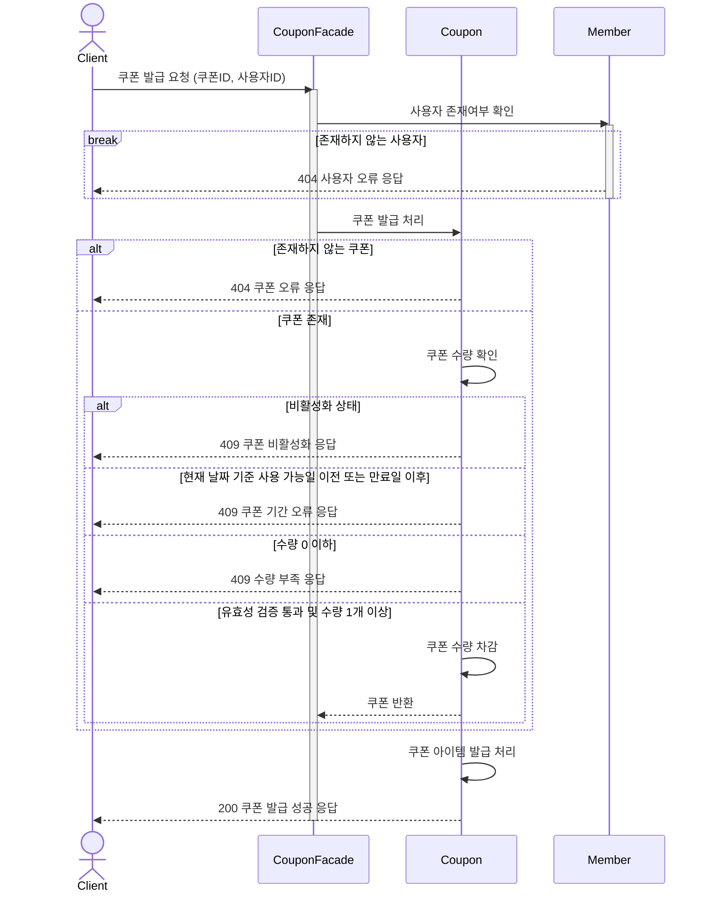

# 쿠폰 발급 시퀀스

```mermaid
sequenceDiagram
    actor Client
    participant CouponFacade
    participant Coupon
    participant Member


    Client->>CouponFacade: 쿠폰 발급 요청 (쿠폰ID, 사용자ID)
    activate CouponFacade
    CouponFacade->>Member: 사용자 존재여부 확인
    activate Member
    break 존재하지 않는 사용자
        Member-->>Client: 404 사용자 오류 응답
    end
    deactivate Member
        CouponFacade->>Coupon: 쿠폰 발급 처리
    alt 존재하지 않는 쿠폰
        Coupon-->>Client: 404 쿠폰 오류 응답

    else 쿠폰 존재
        Coupon->>Coupon: 쿠폰 수량 확인
        alt 비활성화 상태
            Coupon-->>Client: 409 쿠폰 비활성화 응답
        else 현재 날짜 기준 사용 가능일 이전 또는 만료일 이후
            Coupon-->>Client: 409 쿠폰 기간 오류 응답
        else 수량 0 이하
            Coupon-->>Client: 409 수량 부족 응답
        else 유효성 검증 통과 및 수량 1개 이상
            Coupon->>Coupon: 쿠폰 수량 차감
            Coupon -->> CouponFacade : 쿠폰 반환
        end
    end
    Coupon ->> Coupon: 쿠폰 아이템 발급 처리
    Coupon-->>Client: 200 쿠폰 발급 성공 응답
    deactivate CouponFacade

```
