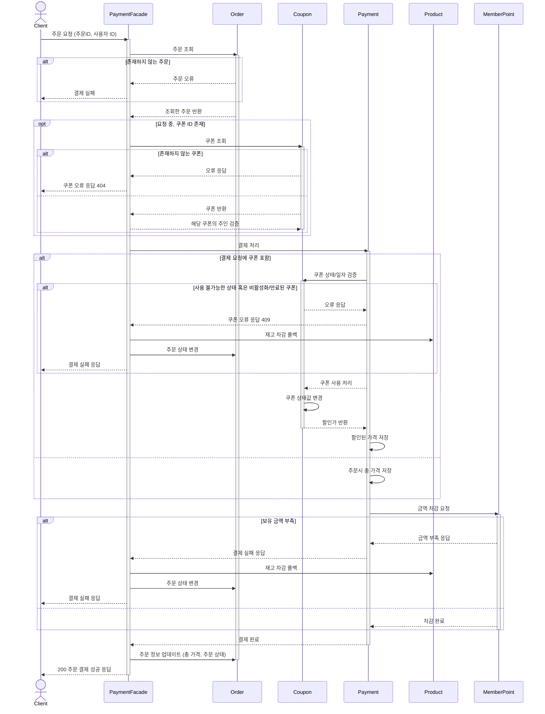

# 주문 결제 시퀀스

```mermaid
sequenceDiagram
    actor Client
    participant PaymentFacade
    participant Order
    participant Coupon
    participant Payment
    participant Product


    Client->>PaymentFacade: 주문 요청 (주문ID, 사용자 ID)
    activate PaymentFacade

%%    PaymentFacade->>Member: 사용자 조회
%%    activate Member
%%    Member-->>PaymentFacade: 사용자 정보
%%    deactivate Member
%%    break 사용자 없음
%%        PaymentFacade-->>Client: 사용자 오류 응답
%%    end
    PaymentFacade ->> Order : 주문 조회
    activate Order
    alt 존재하지 않는 주문
        Order -->> PaymentFacade : 주문 오류
        PaymentFacade -->> Client : 결제 실패
    end

    Order -->> PaymentFacade: 조회한 주문 반환
    opt 요청 중, 쿠폰 ID 존재
        PaymentFacade->>Coupon: 쿠폰 조회
        activate Coupon
        alt 존재하지 않는 쿠폰
            Coupon-->>PaymentFacade: 오류 응답
            PaymentFacade-->>Client: 쿠폰 오류 응답 404
        else
            Coupon-->>PaymentFacade: 쿠폰 반환
            PaymentFacade -->> Coupon : 해당 쿠폰의 주인 검증
            deactivate Coupon
        end
    end
    PaymentFacade->>Payment:  결제 처리
    activate Payment
    alt 결제 요청에 쿠폰 포함
        Payment ->> Coupon : 쿠폰 상태/일자 검증
        activate Coupon
        alt 사용 불가능한 상태 혹은 비활성화/만료된 쿠폰
            Coupon-->>Payment: 오류 응답
            Payment -->> PaymentFacade : 쿠폰 오류 응답 409
            PaymentFacade ->> Product : 재고 차감 롤백
            PaymentFacade ->> Order : 주문 상태 변경
            PaymentFacade-->>Client: 결제 실패 응답
        end
        Payment-->>Coupon: 쿠폰 사용 처리
        Coupon ->> Coupon : 쿠폰 상태값 변경
        Coupon -->> Payment : 할인가 반환
        deactivate Coupon
        Payment ->> Payment : 할인된 가격 저장
    else
        Payment ->> Payment : 주문시 총 가격 저장
    end

    Payment->>MemberPoint: 금액 차감 요청
    activate MemberPoint
    alt 보유 금액 부족
        MemberPoint-->>Payment: 금액 부족 응답
        Payment -->> PaymentFacade : 결제 실패 응답
        PaymentFacade ->> Product : 재고 차감 롤백
        PaymentFacade ->> Order : 주문 상태 변경
        PaymentFacade-->>Client: 결제 실패 응답
    else
        MemberPoint-->>Payment: 차감 완료
    end
    deactivate MemberPoint
    Payment -->> PaymentFacade : 결제 완료
    deactivate Payment
    PaymentFacade ->> Order : 주문 정보 업데이트 (총 가격, 주문 상태)
    deactivate Order
    PaymentFacade -->> Client : 200 주문 결제 성공 응답
    deactivate PaymentFacade


```