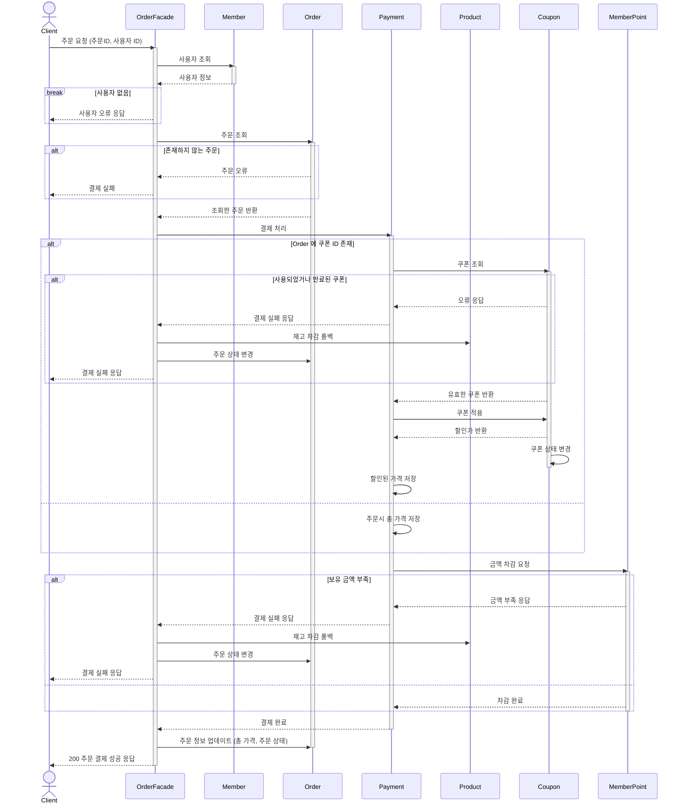

# 주문 결제 시퀀스

```mermaid
sequenceDiagram
    actor Client
    participant OrderFacade
    participant Member
    participant Order
    participant Payment
    participant Product
    participant Coupon


    Client->>OrderFacade: 주문 요청 (주문ID, 사용자 ID)
    activate OrderFacade

    OrderFacade->>Member: 사용자 조회
    activate Member
    Member-->>OrderFacade: 사용자 정보
    deactivate Member
    break 사용자 없음
        OrderFacade-->>Client: 사용자 오류 응답
    end
    OrderFacade ->> Order : 주문 조회
    activate Order
    alt 존재하지 않는 주문
        Order -->> OrderFacade : 주문 오류
        OrderFacade -->> Client : 결제 실패
    end

    Order -->> OrderFacade: 조회한 주문 반환

    OrderFacade->>Payment:  결제 처리
    activate Payment
    alt Order 에 쿠폰 ID 존재
        Payment ->> Coupon : 쿠폰 조회
        activate Coupon
        alt 사용되었거나 만료된 쿠폰
            Coupon-->>Payment: 오류 응답
            Payment -->> OrderFacade : 결제 실패 응답
            OrderFacade ->> Product : 재고 차감 롤백
            OrderFacade ->> Order : 주문 상태 변경
            OrderFacade-->>Client: 결제 실패 응답
        end
        Coupon-->>Payment: 유효한 쿠폰 반환
        Payment ->> Coupon : 쿠폰 적용
        Coupon -->> Payment : 할인가 반환
        Coupon ->> Coupon : 쿠폰 상태 변경
        deactivate Coupon
        Payment ->> Payment : 할인된 가격 저장
    else
        Payment ->> Payment : 주문시 총 가격 저장
    end

    Payment->>MemberPoint: 금액 차감 요청
    activate MemberPoint
    alt 보유 금액 부족
        MemberPoint-->>Payment: 금액 부족 응답
        Payment -->> OrderFacade : 결제 실패 응답
        OrderFacade ->> Product : 재고 차감 롤백
        OrderFacade ->> Order : 주문 상태 변경
        OrderFacade-->>Client: 결제 실패 응답
    else
        MemberPoint-->>Payment: 차감 완료
    end
    deactivate MemberPoint
    Payment -->> OrderFacade : 결제 완료
    deactivate Payment
    OrderFacade ->> Order : 주문 정보 업데이트 (총 가격, 주문 상태)
    deactivate Order
    OrderFacade -->> Client : 200 주문 결제 성공 응답
    deactivate OrderFacade


```