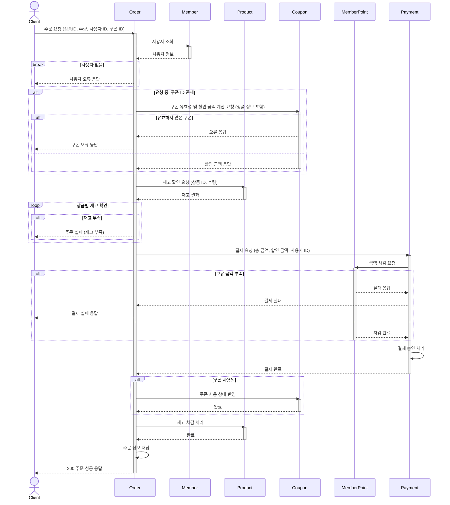

# 주문 시퀀스

```mermaid
sequenceDiagram
    actor Client
    participant Order
    participant Member
    participant Product
    participant Coupon
    participant MemberPoint
    participant Payment

    Client->>Order: 주문 요청 (상품ID, 수량, 사용자 ID, 쿠폰 ID)
    activate Order

    Order->>Member: 사용자 조회
    activate Member
    Member-->>Order: 사용자 정보
    deactivate Member
    break 사용자 없음
        Order-->>Client: 사용자 오류 응답
    end
    alt 요청 중, 쿠폰 ID 존재
        Order->>Coupon: 쿠폰 유효성 및 할인 금액 계산 요청 (상품 정보 포함)
        activate Coupon
        alt 유효하지 않은 쿠폰
            Coupon-->>Order: 오류 응답
            Order-->>Client: 쿠폰 오류 응답
        else
            Coupon-->>Order: 할인 금액 응답
            deactivate Coupon
        end
    end

    Order->>Product: 재고 확인 요청 (상품 ID, 수량)
    activate Product
    Product-->>Order: 재고 결과
    deactivate Product

    loop 상품별 재고 확인
        alt 재고 부족
            Order-->>Client: 주문 실패 (재고 부족)
        end
    end

    Order->>Payment: 결제 요청 (총 금액, 할인 금액, 사용자 ID)
    activate Payment

    Payment->>MemberPoint: 금액 차감 요청
    activate MemberPoint
    alt 보유 금액 부족
        MemberPoint-->>Payment: 실패 응답

        Payment-->>Order: 결제 실패
        Order-->>Client: 결제 실패 응답
    else
        MemberPoint-->>Payment: 차감 완료
    end
    deactivate MemberPoint
    Payment->>Payment: 결제 승인 처리
    Payment-->>Order: 결제 완료
    deactivate Payment

    alt 쿠폰 사용됨
        Order->>Coupon: 쿠폰 사용 상태 반영
        activate Coupon
        Coupon-->>Order: 완료
        deactivate Coupon
    end

    Order->>Product: 재고 차감 처리
    activate Product
    Product-->>Order: 완료
    deactivate Product

    Order->>Order: 주문 정보 저장
    Order-->>Client: 200 주문 성공 응답
    

    deactivate Order

```

