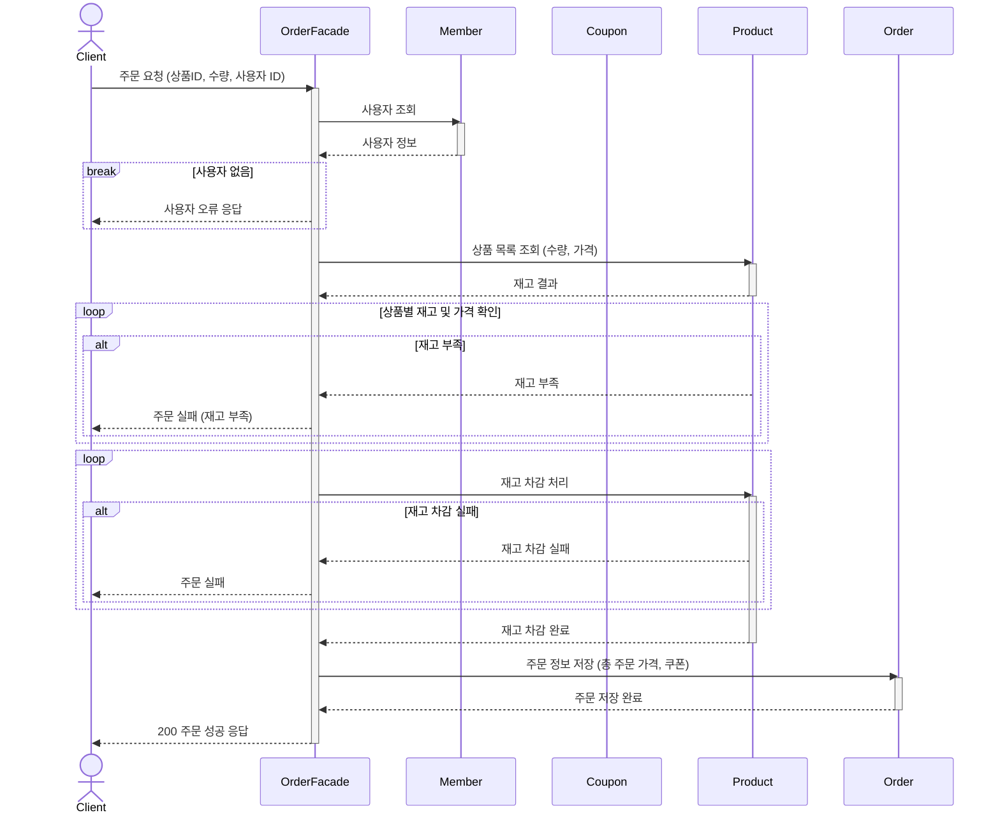

# 주문 시퀀스

```mermaid
sequenceDiagram
    actor Client
    participant OrderFacade
    participant Member
    participant Coupon
    participant Product
    participant Order

    Client->>OrderFacade: 주문 요청 (상품ID, 수량, 사용자 ID)
    activate OrderFacade

    OrderFacade->>Member: 사용자 조회
    activate Member
    Member-->>OrderFacade: 사용자 정보
    deactivate Member
    break 사용자 없음
        OrderFacade-->>Client: 사용자 오류 응답
    end

    OrderFacade->>Product: 상품 목록 조회 (수량, 가격)
    activate Product
    Product-->>OrderFacade: 재고 결과
    deactivate Product

    loop 상품별 재고 및 가격 확인
        alt 재고 부족
            Product-->>OrderFacade: 재고 부족
            OrderFacade -->> Client : 주문 실패 (재고 부족)
        end
    end
    loop
        OrderFacade->>Product: 재고 차감 처리
        activate Product
        alt 재고 차감 실패
            Product -->> OrderFacade : 재고 차감 실패
            OrderFacade -->> Client : 주문 실패
        end
    end
    Product-->>OrderFacade: 재고 차감 완료
    deactivate Product

    OrderFacade->>Order: 주문 정보 저장 (총 주문 가격, 쿠폰)
    activate Order
    Order-->>OrderFacade: 주문 저장 완료
    deactivate Order
    OrderFacade -->> Client : 200 주문 성공 응답
    deactivate OrderFacade

```

