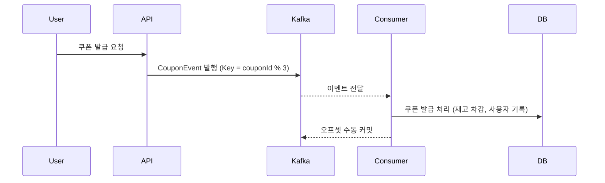

# 선착순 쿠폰 발급 시스템 개선 학습 보고서

## 1. 서론
- 기존 Redis 기반의 선착순 쿠폰 발급 시스템은 실시간성과 응답성이 뛰어나지만, 대량 트래픽 환경에서 병목, 락 충돌, 메모리 초과 등의 문제가 발생합니다.
- 이를 해결하기 위해 Kafka 기반의 비동기 이벤트 처리 아키텍처로 전환합니다.
---

## 2. 기존 시스템 분석 및 문제점

### 2.1 기존 Redis 기반 구조
동기 구조: API 요청 → Redis에서 락 획득 → 재고 차감 → 처리 결과 반환
구현 도구: Redisson, Spring Scheduler

### 2.2 주요 문제점
| 문제 항목    | 설명                                             |
| -------- |------------------------------------------------|
| 단일 병목    | Redis 단일 노드 또는 마스터/슬레이브 구조로 락 획득 충돌 및 처리 지연 발생 |
| 메모리 한계   | Redis에 상태 정보 (재고, 사용자 요청 등)를 모두 저장 → 메모리 초과 위험 |
| 락 충돌 빈도  | SETNX 기반 Redisson 락 충돌로 인한 응답 지연               |
| 순차성/중복처리 | 실시간 중복 제어 및 순서 보장이 어렵고 클라이언트 반복 요청 대응 한계       |
| 장애 복구    | Redis 상태 복구 및 롤백이 어려움                          |
| 배치 지연    | Scheduler 기반 처리 주기에 따른 10분 발급 지연            |

---

## 3. Kafka 기반 개선 시스템 설계
### 3.1 개선 목표
- 병목 제거 및 확장성 확보
- 비동기 메시징 구조로 시스템 분리
- 순차성과 중복 제어 향상
- 장애 복구 및 메시지 내구성 확보

### 3.2 주요 전략
| 전략      | 설명                                                          |
| ------- |-------------------------------------------------------------|
| 비동기 처리  | Kafka Producer가 사용자 요청을 즉시 발행, Consumer가 비동기로 처리            |
| 병렬성     | Kafka 파티션 기반 병렬 처리 → 소비자 수평 확장 가능                           |
| 순차성 보장  | 특정 키(couponId) 기반 파티션 지정으로 이벤트 순서 보장                        |
| 중복 처리   | `couponId\:memberId`를 메시지 키로 설정, Redis 또는 AOP로 idempotency 구현 |
| 내구성/복구성 | Kafka 메시지 디스크 저장 → 장애 시 재처리 가능                              |
| 캐시 분리   | 상태 저장은 DB 중심, Redis는 조회용 캐시로만 사용                            |

---

## 4. Kafka 기반 구현 상세

### 4.1 파티셔닝 전략
| 기준    | 설정 방법                       | 장점                        |
| ----- | --------------------------- | ------------------------- |
| 쿠폰 ID | `couponId % partitionCount` | 파티션 균등 분배, 동일 쿠폰 요청 순서 보장 |
| 주문 ID | 주문별 고유 키 지정                 | 결제 연계 이벤트 순서 보장           |

---

## 5. 쿠폰 발급 시퀀스 다이어그램

---
## 6. 장애 대응 및 확장성
| 항목     | Kafka 기반 시스템                    |
| ------ | ------------------------------- |
| 메시지 유실 | 수동 커밋 및 디스크 저장으로 방지             |
| 재처리    | Consumer 장애 시 오프셋 기준 재처리 가능     |
| 확장성    | Consumer 그룹 수평 확장으로 트래픽 대응      |
| 가용성    | Kafka 클러스터 및 파티션 복제 구조로 고가용성 보장 |

---
## 7. 결론
- Kafka 기반 이벤트 아키텍처는 다음과 같은 장점을 제공합니다.
  - 병목 제거 및 처리 병렬화로 높은 TPS 확보
  - 클라이언트 응답 속도 개선 및 시스템 분산 처리 구조로 확장성 강화
  - 순차성 보장 및 중복 처리 안정성 확보
  - 장애 복구, 로그 추적, 처리 내역 재검토 가능
  = 결론적으로, Redis 기반 시스템은 간결하지만 대규모 환경에서는 한계가 명확합니다. Kafka는 복잡성을 일부 증가시키는 대신, 안정성과 성능, 복구력 측면에서 압도적인 개선 효과를 제공합니다.