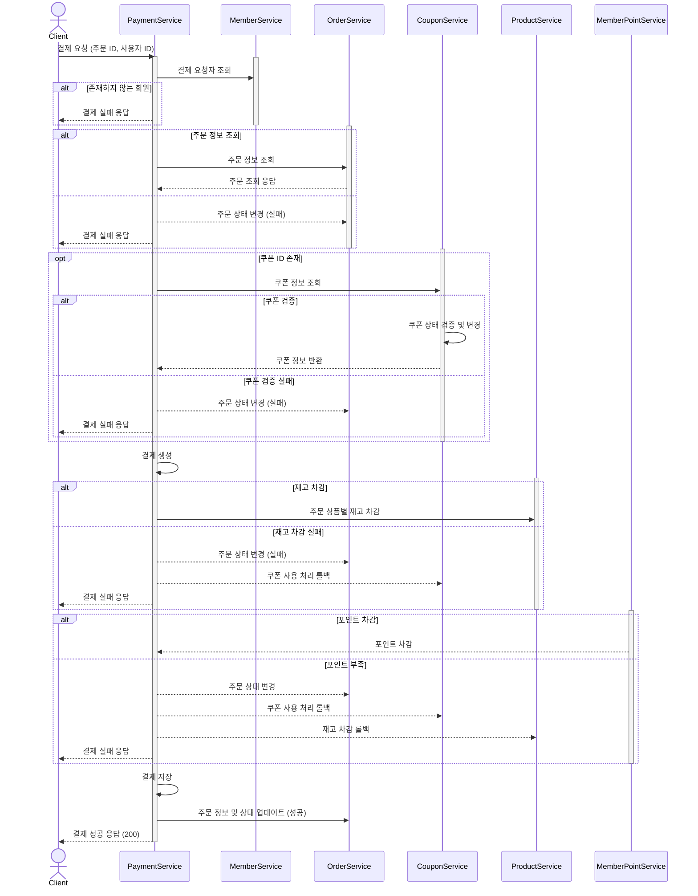

# MSA 도메인별 분리 전략 보고서
## 1️⃣ 개요
- MSA 형태로 도메인 단위로 서비스를 분리하는 전략을 제안합니다.
- 각 도메인의 분리 기준과 함께, 분리에 따른 기술적 한계점과 해결 방안도 함께 서술합니다.

---
## 2️⃣ 도메인 단위 분리
### 2-1. 도메인 분리 기준
- 라이프 사이클의 독립성 : 각 도메인이 자체의 생명주기를 가지고 있는 경우 분리
- 트랜잭션 결합도 : 복수 도메인 간 트랜잭션이 강하게 결합된 경우 같은 서비스로 묶는 것을 고려

### 2-2. 도메인별 배포 단위
| 서비스명          | 도메인     | 도메인 분리 근거                                          |
|---------------| ------- |----------------------------------------------------|
| `Member`      | Member    | 사용자 관리의 독립된 라이프사이클과 낮은 결합도                         |
| `MemberPoint` | MemberPoint  | 자체 적립/회수/정산 주기                       |
| `Product`     | Product | 타 도메인과 낮은 실시간 트랜잭션 필요성                             |
| `Coupon`      | Coupon  | 쿠폰 정책 변경이 잦으며, 이벤트 기반 처리 가능 → 독립 배포 필요             |
| `Order`       | Order   | 주문 도메인은 결제와 별개로 비즈니스 로직 존재. 상태(status) 전이 기반 처리 가능 |
| `Payment`     | Payment | 외부 결제 시스템과의 연동, 실패 처리 책임이 크므로 독립적 서비스 필요           |

---
## 3️⃣ 데이터 정합성

### 3-1. 주문 및 결제 API 호출 구조

: 주문 생성 및 결제 프로세스 흐름

- 클라이언트가 Order 서비스에 주문 요청

- Order 서비스는 Order, OrderItem을 생성하여 저장 (사전 단계)

- 클라이언트가 Payment 서비스에 결제 요청

- Payment 서비스는 다음 순서로 도메인 협업을 수행
  - 사용자 정보 조회 : Member 서비스에서 주문자 정보 조회
  - 주문 정보 확인 : Order 서비스에서 주문 정보 조회 및 주문자 검증
  - 쿠폰 적용 : 쿠폰이 있다면 Coupon 서비스에서 쿠폰 검증 및 소유자 확인
  - 결제 처리 : Payment 도메인 내부에서 결제 생성
  - 재고 차감 : Product 서비스에 재고 차감 요청
  - 포인트 차감 : MemberPoint 서비스에서 사용자 포인트 차감
  - 결제 완료 처리 : 결제 상태를 PAID로 전이
  - 완료 이벤트 발행 : Payment.Completed 이벤트 발행

오류 발생 시

- 재고 부족, 포인트 부족, 쿠폰 검증 실패 등 발생 시 예외가 발생하며, 트랜잭션 롤백됨

- 보상 로직은 Payment.Completed 이벤트에 의존한 후속 처리 또는 SAGA 패턴으로 구성 가능

### 3-2. 보상 트랜잭션 처리 전략
- 결제 단계 실패 유형 및 대응

| 실패 유형          | 원인 설명              | 보상 처리 방식                        |
|----------------|-------------------------|------------------------------------------|
| **쿠폰 적용 실패**   | 쿠폰 유효기간 만료, 사용 조건 불충족 등 | `Order` 상태 "결제 실패"로 전이|
| **재고 부족**      | 결제 요청 시점에 재고가 소진된 경우| `Order` 상태를 "결제 실패"로 변경, 재고 차감 복구, 쿠폰 사용 처리 복구|
| **잔액 부족**      | 사용자 잔액 부족               | 결제 실패로 처리, `Order` 상태 전이, 재고 차감 복구, 쿠폰 사용 처리 복구 |

---
## 4️⃣ 결론
- 각 도메인은 비즈니스 책임, 트랜잭션 결합도를 기준으로 독립성 있게 분리합니다.
- 분리된 도메인 간 트랜잭션 문제는 상태 전이 모델과 보상 트랜잭션(SAGA) 패턴으로 대응합니다.
